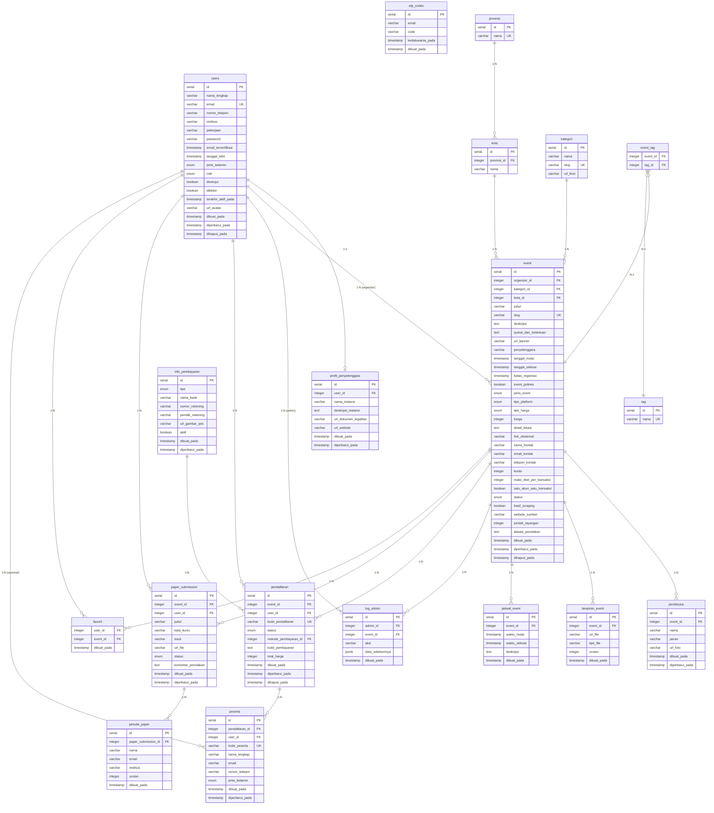

# ERD — SISC (Sistem Informasi Seminar dan Conference)

---

## Ringkasan Relasi (24)

| # | Tabel | Relasi | Target | Keterangan |
|---|-------|--------|--------|------------|
| 1 | `users` | 1:1 | `profil_penyelenggara` | Satu user organizer punya satu profil |
| 2 | `users` | 1:N | `event` | Organizer membuat banyak event |
| 3 | `users` | 1:N | `log_admin` | Admin punya banyak log aktivitas |
| 4 | `users` | 1:N | `pendaftaran` | User daftar ke banyak event |
| 5 | `users` | 1:N | `paper_submission` | User submit banyak paper |
| 6 | `users` | 1:N | `favorit` | User favoritkan banyak event |
| 7 | `users` | 1:N | `peserta` | User bisa jadi peserta (opsional FK) |
| 8 | `provinsi` | 1:N | `kota` | Satu provinsi punya banyak kota |
| 9 | `kota` | 1:N | `event` | Satu kota jadi lokasi banyak event |
| 10 | `kategori` | 1:N | `event` | Satu kategori dipakai banyak event |
| 11 | `tag` | M:N | `event` | Via `event_tag` |
| 12 | `event` | 1:N | `event_tag` | Satu event punya banyak tag |
| 13 | `event` | 1:N | `pembicara` | Satu event punya banyak pembicara |
| 14 | `event` | 1:N | `lampiran_event` | Satu event punya banyak lampiran |
| 15 | `event` | 1:N | `jadwal_event` | Satu event punya banyak jadwal |
| 16 | `event` | 1:N | `log_admin` | Satu event punya banyak log admin |
| 17 | `event` | 1:N | `pendaftaran` | Satu event punya banyak pendaftar |
| 18 | `event` | 1:N | `paper_submission` | Satu event terima banyak paper |
| 19 | `event` | 1:N | `favorit` | Satu event difavoritkan banyak user |
| 20 | `info_pembayaran` | 1:N | `pendaftaran` | Satu metode bayar dipakai banyak pendaftaran |
| 21 | `pendaftaran` | 1:N | `peserta` | Satu pendaftaran bisa banyak peserta |
| 22 | `paper_submission` | 1:N | `penulis_paper` | Satu paper punya banyak penulis |

## Tabel Standalone (tanpa FK)

| Tabel | Keterangan |
|-------|-----------|
| `otp_codes` | Kode OTP verifikasi email (relasi via email string) |

## Tabel Junction (Composite PK)

| Tabel | Kolom PK | Relasi |
|-------|----------|--------|
| `event_tag` | (`event_id`, `tag_id`) | M:N antara event dan tag |
| `favorit` | (`user_id`, `event_id`) | M:N antara user dan event |
