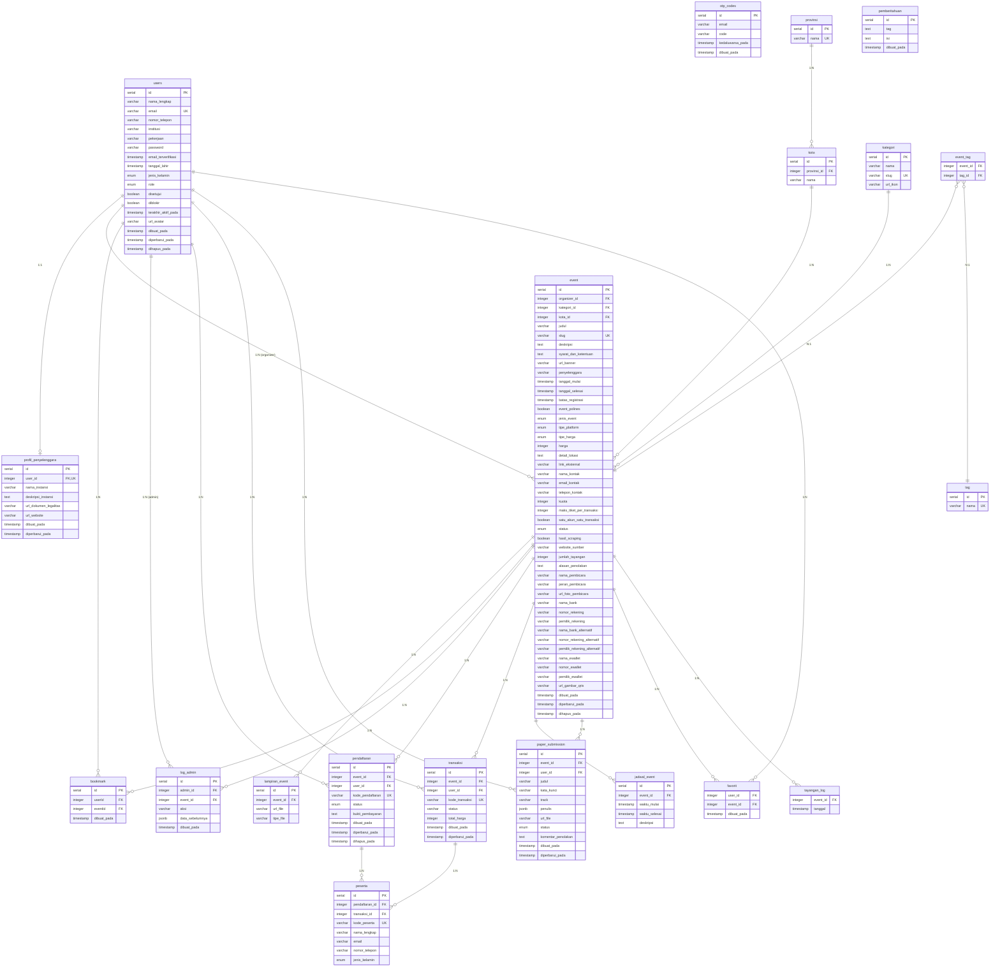

# ERD — SISC (Sistem Informasi Seminar dan Conference)



---

## Relasi dalam Teks

```
┌─────────────────────────────────────────────────────────────────────────────┐
│                              ERD SISC                                       │
├─────────────────────────────────────────────────────────────────────────────┤
│                                                                             │
│  otp_codes (no relasi)         pemberitahuan (no relasi)                   │
│                                                                             │
│  ┌──────────┐       ┌──────────────────────┐                               │
│  │ provinsi │1──N┐  │      kategori        │                               │
│  └──────────┘    │  └──────────────────────┘                               │
│                  │         │                                                │
│                  ▼         │ 1:N                                            │
│  ┌──────────┐    N┌──┐    ▼                                                │
│  │   kota   │──N─┤  │ event_tag (M:N) ── tag                              │
│  └──────────┘    │  │                                                       │
│         │        │  │                                                       │
│         │ 1:N    │  │                                                       │
│         ▼        │  │                                                       │
│  ┌──────────────────────────────────────────────────────────────────────┐  │
│  │                              event                                    │  │
│  │  organizer_id ────┐                                                  │  │
│  └──────────────────────────────────────────────────────────────────────┘  │
│     │ 1:N    │ 1:N   │ 1:N   │ 1:N    │ 1:N    │ 1:N    │ 1:N    │ 1:N   │
│     ▼        ▼       ▼       ▼        ▼        ▼        ▼        ▼       │
│  ┌──────┐ ┌──────┐ ┌────┐ ┌──────┐ ┌──────┐ ┌──────┐ ┌──────┐ ┌──────┐  │
│  │lamp  │ │jadwal│ │bk  │ │log   │ │pendaf│ │trans │ │paper │ │tayang│  │
│  │_event│ │_event│ │mark│ │admin │ │taratan│ │aksi  │ │submit│ │_log  │  │
│  └──────┘ └──────┘ └────┘ └──────┘ └──────┘ └──────┘ └──────┘ └──────┘  │
│                                          │         │                       │
│                                          │ 1:N     │ 1:N                   │
│                                          ▼         ▼                       │
│                                     ┌──────────────────┐                   │
│                                     │     peserta      │                   │
│                                     │ pendaftaran_id   │                   │
│                                     │ transaksi_id     │                   │
│                                     └──────────────────┘                   │
│                                                                             │
│  ┌──────────┐   1:1   ┌──────────────────────┐                             │
│  │   users  │◄────────│ profil_penyelenggara  │                             │
│  └──────────┘         └──────────────────────┘                             │
│       │                                                                     │
│       │ 1:N (sebagai organizer_id di event)                                │
│       │ 1:N (sebagai admin_id di log_admin)                                │
│       │ 1:N (sebagai user_id di bookmark, pendaftaran, transaksi,          │
│       │      paper_submission, favorit)                                    │
│                                                                             │
└─────────────────────────────────────────────────────────────────────────────┘
```

## Ringkasan Relasi

| # | Tabel | Relasi | Target | Tipe |
|---|-------|--------|--------|------|
| 1 | `users` | 1:1 | `profil_penyelenggara` | Satu user (organizer) punya satu profil |
| 2 | `users` | 1:N | `event` | Satu user bisa membuat banyak event (sebagai organizer) |
| 3 | `users` | 1:N | `bookmark` | Satu user bisa punya banyak bookmark |
| 4 | `users` | 1:N | `log_admin` | Satu admin bisa punya banyak log aktivitas |
| 5 | `users` | 1:N | `pendaftaran` | Satu user bisa daftar ke banyak event |
| 6 | `users` | 1:N | `transaksi` | Satu user bisa punya banyak transaksi |
| 7 | `users` | 1:N | `paper_submission` | Satu user bisa submit banyak paper |
| 8 | `users` | 1:N | `favorit` | Satu user bisa favoritkan banyak event |
| 9 | `provinsi` | 1:N | `kota` | Satu provinsi punya banyak kota |
| 10 | `kota` | 1:N | `event` | Satu kota bisa jadi lokasi banyak event |
| 11 | `kategori` | 1:N | `event` | Satu kategori bisa dipakai banyak event |
| 12 | `tag` | M:N | `event` | (via `event_tag`) Banyak tag bisa dipakai banyak event |
| 13 | `event` | 1:N | `event_tag` | Satu event punya banyak tag |
| 14 | `event` | 1:N | `lampiran_event` | Satu event punya banyak lampiran |
| 15 | `event` | 1:N | `bookmark` | Satu event bisa di-bookmark banyak user |
| 16 | `event` | 1:N | `log_admin` | Satu event punya banyak log admin |
| 17 | `event` | 1:N | `pendaftaran` | Satu event punya banyak pendaftar |
| 18 | `event` | 1:N | `transaksi` | Satu event punya banyak transaksi |
| 19 | `event` | 1:N | `jadwal_event` | Satu event punya banyak jadwal |
| 20 | `event` | 1:N | `paper_submission` | Satu event terima banyak paper |
| 21 | `event` | 1:N | `favorit` | Satu event bisa difavoritkan banyak user |
| 22 | `event` | 1:N | `tayangan_log` | Satu event punya banyak log tayangan |
| 23 | `pendaftaran` | 1:N | `peserta` | Satu pendaftaran bisa punya banyak peserta |
| 24 | `transaksi` | 1:N | `peserta` | Satu transaksi bisa untuk banyak peserta |

## Tabel Standalone (tanpa FK)

| Tabel | Keterangan |
|-------|-----------|
| `otp_codes` | Kode OTP verifikasi email (tidak terikat relasi FK) |
| `pemberitahuan` | Notifikasi sistem (tidak terikat relasi FK) |

## Tabel Junction (Composite PK)

| Tabel | Kolom PK | Relasi |
|-------|----------|--------|
| `event_tag` | (`event_id`, `tag_id`) | M:N antara event dan tag |
| `favorit` | (`user_id`, `event_id`) | M:N antara user dan event |
